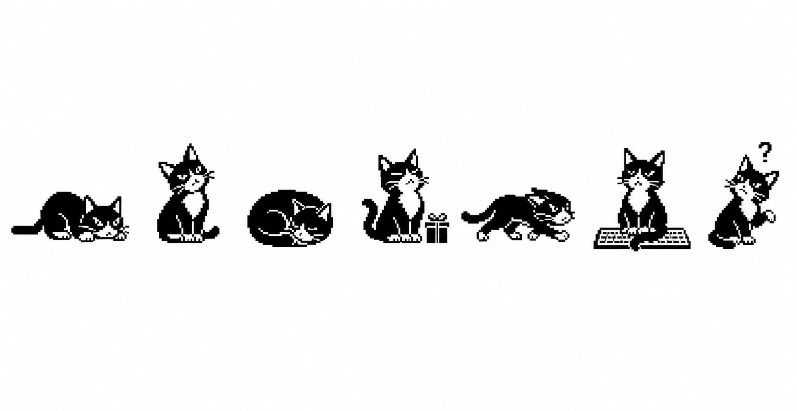

# Patch monorepo

> Your AI assistant builds and remembers its own tools.

<p align="center">
  
</p>

This is the source-of-truth monorepo for [Patch](https://patch-cat.com), an MCP server that gives any AI host (Claude Desktop, Cursor, Claude Code, Windsurf) a permanent, growing toolbox of executable Python tools.

## Packages

| Package | Path | Description |
|---------|------|-------------|
| [`@patch-cat/mcp`](./packages/mcp) | `packages/mcp` | The local MCP server (npx-installable). |
| [`@patch-cat/registry`](./packages/registry) | `packages/registry` | Hosted Cloudflare Worker registry. |
| [`@patch-cat/shared`](./packages/shared) | `packages/shared` | Shared zod schemas + API types. Workspace-internal. |

For end-user setup, start with [`packages/mcp/README.md`](./packages/mcp/README.md).

Architectural rules and stack lock-in are documented internally; the highlights surface in [`packages/docs/src/content/docs/architecture.md`](./packages/docs/src/content/docs/architecture.md) and [`THREAT_MODEL.md`](./THREAT_MODEL.md).

## Development

```bash
pnpm install
pnpm build       # builds all publishable packages
pnpm test        # runs all package tests via vitest workspace
pnpm typecheck   # tsc --noEmit across all packages
```

## License

MIT
